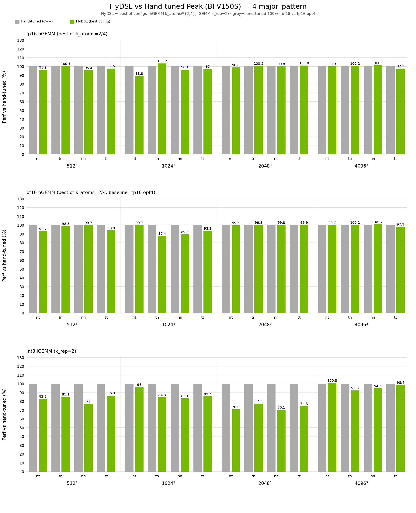

# FlyDSL on Iluvatar (FlyIXDL)

FlyDSL includes an **Iluvatar** compile and runtime backend targeting the **FlyIXDL**
dialect. Kernels are authored in the same Python layout DSL and `@flyc.kernel` /
`@flyc.jit` APIs as the ROCm path; lowering goes through `fly` → `FlyIXDL` → IXDL
LLVM IR → device fatbin.

This document covers Iluvatar-specific features, supported hardware, runnable
examples, and HGEMM / IGEMM performance vs hand-tuned kernels.

## Features

| Area | What is provided |
|------|------------------|
| **Dialect & lowering** | `FlyIXDL` dialect, `convert-fly-to-ixdl`, `gpu-to-ixdl`, `ixdl-attach-target` pipeline (`python/flydsl/compiler/backends/iluvatar.py`) |
| **Layout algebra** | Same Fly layout API as ROCm (`logical_divide`, `copy_atom_call`, `make_tiled_copy_*`, …) |
| **SME async copy** | `MRAsyncCpRow8b` / `Row16b` / `Col`, `make_sme_gmem_tensor`, `make_sme_shared_layout` / `make_sme_shared_layout_k_spanning`, `cp_async_commit_group` / `cp_async_wait_group` (`python/flydsl/expr/ixdl/`) |
| **Pipeline sync** | `sl_waitmem`, `sl_pipebar_arrive`, `sl_pipebar_wait` for software-pipelined kernels |
| **Tensor core MMA** | `MRMma` — **16×16×16 f16** and **16×16×32 i8→i32**; MMA-coupled S2R via `make_tiled_copy_A/B` |
| **Production HGEMM** | `kernels.gemm.iluvatar.mr.hgemm` — double-buffered G2S, Ki-deferred S2R/MMA, configurable epilogue / major pattern |
| **Production IGEMM** | `kernels.gemm.iluvatar.mr.igemm` — int8×int8 → i32/i8, same MR SME pipeline helpers as HGEMM (`mr_gemm_*`) |
| **GEMV V1** | `kernels.gemm.iluvatar.gemv` — `F.linear`-aligned M=1, fp16/bf16, fp32 accum |
| **JIT runtime** | `libfly_iluvatar_jit_runtime.so`, `FLYDSL_RUNTIME_KIND=iluvatar` |
| **Unit / device tests** | `tests/unit/test_iluvatar_*` (backend, runtime, G2S/S2R/MMA/epilogue/HGEMM stages, GEMV); IGEMM via example `--check` |
| **CI (optional)** | Iluvatar `ci-core` / `ci-device`, IX toolchain refresh, publish-image, perf-daily (see `.github/workflows/*iluvatar*`) |

### Kernel package layout

```text
kernels/gemm/iluvatar/
  common.py          # GemmLayout, WARP_SIZE, parse_major_pattern, …
  epilogue.py        # HGEMM fp16 stores + IGEMM i32 / i8 packed stores
  gemv.py            # GEMV V1
  mr/
    common.py        # MrOperandGeom, mr_stage_smem_ab, byte_perm, …
    hgemm.py         # compile_iluvatar_mr_hgemm
    igemm.py         # compile_iluvatar_mr_igemm
    operand_copy.py  # mr_gemm_g2s_issue_* (dtype-generic)
    s2r.py           # mr_gemm_s2r_* (dtype-generic; i8 k-spanning)
```

## Supported hardware

| Item | Details |
|------|---------|
| **Primary target** | **ivcore11** (default `ARCH`) — Iluvatar **BI-V150**, **BI-V150S**, **MR-100**, **MR-50** |
| **Future chips** | `ARCH=ivcore30` (and other ixdl chip strings) are accepted by the compile backend when the IXDL toolchain supports them |
| **Warp size** | 64 lanes |
| **Block shared memory** | 128 KiB per CTA (ivcore11 device property) |
| **Host API** | CUDA-compatible PyTorch tensors and streams (`torch.cuda.*`) with the Iluvatar driver stack |

> **Note:** The main FlyDSL README lists AMD ROCm platforms. Iluvatar is a separate
> backend; enable it at CMake configure time (see below).

## Build

Iluvatar is optional and off by default. **MLIR must come from [ixcc](https://github.com/IluvatarCorex/ixcc)** (Iluvatar LLVM fork with `IXDL` dialect), **not** from FlyDSL `scripts/build_llvm.sh` (upstream ROCm LLVM lacks `ixdl-attach-target` / fatbin lowering).

**Prerequisites**

1. **ixcc MLIR** — build ixcc with `mlir;clang;lld`, `MLIR_ENABLE_BINDINGS_PYTHON=ON`, then set `MLIR_DIR` to `…/lib/cmake/mlir` in the ixcc build or install tree.
2. **CoreX / CUDA-compatible toolkit** — `CUDAToolkit_ROOT` for `libfly_iluvatar_jit_runtime.so` and runtime driver loading.

```bash
export MLIR_DIR=~/sw_home/sdk/ixcc/build-flydsl/lib/cmake/mlir
export CUDAToolkit_ROOT=/path/to/corex

cmake -S . -B build-fly \
  -DFLYDSL_BACKENDS="iluvatar" \
  -DMLIR_DIR="${MLIR_DIR}" \
  -DCUDAToolkit_ROOT="${CUDAToolkit_ROOT}"
cmake --build build-fly -j$(nproc)
pip install -e .

# Sanity check: fly-opt must list IXDL passes
build-fly/bin/fly-opt --help | grep ixdl-attach-target
```

If not using editable install:

```bash
export PYTHONPATH="${PWD}/build-fly/python_packages:${PWD}:${PYTHONPATH}"
export LD_LIBRARY_PATH="${CUDAToolkit_ROOT}/lib64:${PWD}/build-fly/python_packages/flydsl/_mlir/_mlir_libs:${LD_LIBRARY_PATH}"
```

## Environment

| Variable | Typical value | Purpose |
|----------|---------------|---------|
| `FLYDSL_COMPILE_BACKEND` | `iluvatar` | Select Iluvatar compile pipeline |
| `FLYDSL_RUNTIME_KIND` | `iluvatar` | Select Iluvatar JIT runtime |
| `ARCH` | `ivcore11` | IXDL chip target (override per card generation) |
| `COMPILE_ONLY` | `1` | Compile without device execution (CI / no GPU) |
| `FLYDSL_RUNTIME_ENABLE_CACHE` | `0` | Disable disk cache while iterating on kernel or pass changes |
| `FLYDSL_ILUVATAR_RUN_MR_*` / `…_GEMV` / `…_JIT_SMOKE` | `1` | Opt-in gates for device pytest modules (default off / skip) |

Iluvatar examples set the first three via `os.environ.setdefault(...)`.

## Examples

Start here after a successful Iluvatar build:

| Example | Purpose |
|---------|---------|
| [`examples/02-tiledCopy-iluvatar-mr.py`](examples/02-tiledCopy-iluvatar-mr.py) | **Teaching** TiledCopy + SME async G2S/S2R on a single 16×16 tile per warp; explicit `cp_async_wait`; good for layout/swizzle debugging |
| [`examples/03-tiledMma-iluvatar-mr-pipeline-hgemm.py`](examples/03-tiledMma-iluvatar-mr-pipeline-hgemm.py) | **Check / bench** harness for pipelined **f16 HGEMM** (`--check`, `--bench`, CTA presets, epilogue / store modes) |
| [`examples/03-tiledMma-iluvatar-mr-pipeline-igemm.py`](examples/03-tiledMma-iluvatar-mr-pipeline-igemm.py) | **Check / bench** harness for pipelined **int8 IGEMM** (`--epilogue i32\|i8`, four `major_pattern`s) |

```bash
export FLYDSL_COMPILE_BACKEND=iluvatar
export FLYDSL_RUNTIME_KIND=iluvatar
export ARCH=ivcore11

# HGEMM correctness (small shapes)
python examples/03-tiledMma-iluvatar-mr-pipeline-hgemm.py --check

# IGEMM correctness (default check shape; try --epilogue i8 / other patterns)
python examples/03-tiledMma-iluvatar-mr-pipeline-igemm.py --check --major-pattern tn --epilogue i32

# HGEMM peak-shape reference (Gate2-style contract — see performance section)
python examples/03-tiledMma-iluvatar-mr-pipeline-hgemm.py --bench \
  --m 4096 --n 4096 --k 4096 --cta 1024 --k-atoms 2 \
  --epilogue no_c_read --epilogue-store shfl --major-pattern tn \
  --warmup 1 --iters 100
```

**Production imports:**

```python
import flydsl.expr as fx
from kernels.gemm.iluvatar.mr.hgemm import compile_iluvatar_mr_hgemm
from kernels.gemm.iluvatar.mr.igemm import compile_iluvatar_mr_igemm
from kernels.gemm.iluvatar.gemv import compile_iluvatar_gemv

launch_h = compile_iluvatar_mr_hgemm(
    M=4096, N=4096, K=4096,
    elem_dtype=fx.Float16,      # or fx.BFloat16; A/B (and no_c_read C) dtype
    major_pattern="tn",         # CUTLASS 3.x BLAS tag (default: A/B both K-major)
    epilogue="no_c_read",       # D = A @ B.T, f16/bf16, no C read
    epilogue_store="shfl",      # warp-shuffle epilogue (fastest for no_c_read)
    k_atoms=2,                  # BK = 16 * k_atoms = 32
)
launch_h(A, B, C, stream=torch.cuda.Stream())

launch_i = compile_iluvatar_mr_igemm(
    M=1024, N=1024, K=1024,
    major_pattern="tn",
    epilogue="i32",             # or "i8" (packed store, truncating cast)
)
launch_i(A_i8, B_i8, C_i32, stream=torch.cuda.Stream())

launch_v = compile_iluvatar_gemv(N=4096, K=4096)
y = launch_v(x, w, bias=None)   # x: [K] or [1,K]; w: [N,K]; fp16/bf16
```

See module docstrings under `kernels/gemm/iluvatar/` for tuning parameters
(`major_pattern`, CTA presets `1024` / `2048`, epilogue modes, GEMV tile constraints, etc.).

## Performance reference

Measured on **Iluvatar BI-V150S** (`ARCH=ivcore11`). All four `major_pattern`
values (`nt` / `tn` / `nn` / `tt`) × square sizes. **Grey** = matched hand-tuned
(100%); **green** = FlyDSL % of that baseline, taking the **best FlyDSL config**
per point — fp16/bf16 hGEMM best of `k_atoms∈{2,4}` (`no_c_read`+`shfl`,
`cta=1024`) vs `mr_gemm_fp16_db_trad_opt4 -T=…` (bf16 has no hand-tuned binary,
so the same fp16 opt4 peak is the baseline); iGEMM `k_rep=2`, `i32`, `cta=1024`
vs `opt6` (4096³ also vs `opt4`, take higher). Sampling: `warmup=1`,
`iters=100`, median of 5 runs.

<p align="center">
  
</p>

Reproduce (hGEMM: try both `k_atoms` and keep the better; add `--dtype bf16` for the middle panel):

```bash
for p in nt tn nn tt; do
  for ka in 2 4; do
    python examples/03-tiledMma-iluvatar-mr-pipeline-hgemm.py --bench \
      --epilogue no_c_read --epilogue-store shfl --k-atoms "$ka" --cta 1024 \
      --major-pattern "$p" --warmup 1 --iters 100 --m <M> --n <N> --k <K>
  done
  python examples/03-tiledMma-iluvatar-mr-pipeline-igemm.py --bench \
    --epilogue i32 --cta 1024 --k-rep 2 --major-pattern "$p" \
    --warmup 1 --iters 100 --m <M> --n <N> --k <K>
done
```

### `major_pattern` (CUTLASS 3.x BLAS layout tags)

Logical tensors are always `A(m,k)`, `B(n,k)` (CuTe `M×K · N×K`). Tags are opaque
BLAS names — **do not** decode each letter as that operand's M/N/K major mode.
Major modes describe logical layouts; host shapes are `tensor.shape` after remap.
Internally kernels use ``GemmLayout`` (`a_mn_major` / `b_mn_major` in
``kernels/gemm/iluvatar/common.py``), not integer pattern ids.
Table order matches the [CuTe gemm tutorial](https://github.com/NVIDIA/cutlass/blob/main/media/docs/cpp/cute/0x_gemm_tutorial.md):

| Pattern | A major | B major | Host `A.shape`, `B.shape` | Native path? |
|---------|---------|---------|-----------------------------|--------------|
| `nt` | M | N | `(k,m)`, `(k,n)` | host transpose |
| `tn` | K | K | `(m,k)`, `(n,k)` | **yes** (default) |
| `nn` | M | K | `(k,m)`, `(n,k)` | host transpose |
| `tt` | K | N | `(m,k)`, `(k,n)` | host transpose |

Choose the pattern that matches your framework tensor layouts; peak TFLOPS at 4k are
similar across all four when host tensors use the expected physical layout.

### Epilogue modes (HGEMM)

| Mode | Compute | Output dtype | Global C read | Typical use |
|------|---------|--------------|---------------|-------------|
| `no_c_read` | `D = A @ B.T` | f16 / bf16 (`elem_dtype`) | No | Inference GEMM, peak TFLOPS |
| `read_c_accum` | `C = A @ B.T + C` | fp32 | Yes | Training / accumulation |

`epilogue_store` applies to `no_c_read` only: **`shfl`** (default, fastest) or
**`tiled`** (`trunc_f` + `UniversalCopy16b`).

IGEMM uses `--epilogue i32` (direct int32 store) or `i8` (packed store with
truncating cast; no quant scale).

## Local correctness gate (no CI)

Use the example **03** harnesses on a machine with an Iluvatar GPU.

**HGEMM** — default `--check-shape` is `256 256 64`; default `--epilogue both` runs
`no_c_read` and `read_c_accum` for the chosen `--major-pattern`:

```bash
FLYDSL_COMPILE_BACKEND=iluvatar FLYDSL_RUNTIME_KIND=iluvatar \
  python examples/03-tiledMma-iluvatar-mr-pipeline-hgemm.py --check \
  --major-pattern tn
```

All four `major_pattern` values:

```bash
for p in nt tn nn tt; do
  FLYDSL_COMPILE_BACKEND=iluvatar FLYDSL_RUNTIME_KIND=iluvatar \
    python examples/03-tiledMma-iluvatar-mr-pipeline-hgemm.py --check \
    --major-pattern "$p" || exit 1
done
```

**IGEMM** — four patterns × `{i32,i8}`:

```bash
for p in tn nt nn tt; do
  for e in i32 i8; do
    FLYDSL_COMPILE_BACKEND=iluvatar FLYDSL_RUNTIME_KIND=iluvatar \
      python examples/03-tiledMma-iluvatar-mr-pipeline-igemm.py --check \
      --major-pattern "$p" --epilogue "$e" || exit 1
  done
done
```

Staged device unit tests (`test_iluvatar_mr_*`, `test_iluvatar_gemv.py`) cover G2S,
S2R, MMA, epilogue, HGEMM pipeline stages, and GEMV. Enable with the matching
`FLYDSL_ILUVATAR_RUN_*` environment variables (see test modules).

Example harnesses exit non-zero if any check fails, so they can be used as a manual
pre-bench / pre-commit gate on machines without CI.

### CTA presets (HGEMM / IGEMM)

| Preset | Warps (M×N) | Warp tile | Block output tile | Guidance |
|--------|-------------|-----------|-------------------|----------|
| `1024` | 4×4 | 64×64 | 256×256 | HGEMM peak: `k_atoms=2`; IGEMM uses `k_rep` (BK = 32 × k_rep) |
| `2048` | 4×8 | 64×32 | 256×256 | HGEMM usually `k_atoms ≥ 4` for even SME work within 128 KiB smem |

M/N must be multiples of the CTA tile (**256** for these presets); **128³** is not a
valid default-CTA shape.

## Tests

Compile-only backend smoke (no GPU):

```bash
COMPILE_ONLY=1 FLYDSL_COMPILE_BACKEND=iluvatar FLYDSL_RUNTIME_KIND=iluvatar \
  python3 -m pytest tests/unit/test_iluvatar_compile_backend.py -v
```

With device (Iluvatar driver + CUDA-enabled PyTorch), opt-in gates required:

```bash
export FLYDSL_COMPILE_BACKEND=iluvatar FLYDSL_RUNTIME_KIND=iluvatar
export FLYDSL_ILUVATAR_RUN_MR_ASYNC_CP=1 FLYDSL_ILUVATAR_RUN_MR_MMA=1
export FLYDSL_ILUVATAR_RUN_MR_S2R=1 FLYDSL_ILUVATAR_RUN_MR_S2R_MMA=1
export FLYDSL_ILUVATAR_RUN_MR_EPILOGUE=1 FLYDSL_ILUVATAR_RUN_MR_HGEMM_STAGES=1
export FLYDSL_ILUVATAR_RUN_JIT_SMOKE=1 FLYDSL_ILUVATAR_RUN_GEMV=1

python3 -m pytest tests/unit/test_iluvatar*.py -v
```

MLIR FileCheck (needs `fly-opt` + `FileCheck` on `PATH`):

```bash
# e.g. tests/mlir/Conversion/ixdl_*.mlir
```

## Known issues

| Area | Status | Notes |
|------|--------|-------|
| **Small-shape HGEMM perf** | Sub-peak / noisy | Below **~2048³**, TFLOPS are far from 4k peak and sensitive to launch/JIT and `k_atoms`. Quote **Gate2 contract** medians; treat smaller shapes as indicative. |
| **B8 / INT8 GEMM** | **Implemented (MR IGEMM)** | `kernels.gemm.iluvatar.mr.igemm` + example 03-igemm; i32 / i8 epilogues; four major patterns. Further quant-scale / fused epilogues still open. |
| **GEMV** | V1 only | `kernels.gemm.iluvatar.gemv` — M=1, strict N/K tile divisibility; not a general batched GEMV. |
| **Other production kernels** | ROCm-only today | Main FlyDSL portfolio (FP8/INT4 preshuffle GEMM, MoE, attention, norms, all-reduce, …) has **no Iluvatar port** yet beyond HGEMM / IGEMM / GEMV + teaching/unit coverage. |
| **S2R register pressure** | Tuning item | Shared→register uses generic `UniversalCopy32b` tiling rather than a TCU-specialized load; SRF usage on large shapes is higher than ideal and may leave headroom on the table. |
| **Multi-GPU** | Not supported | No Iluvatar multi-device runtime or collective kernels (e.g. custom all-reduce). |
| **ivcore30+** | Bring-up incomplete | `ARCH=ivcore30` is accepted by the compile backend; device validation and kernel tuning on newer chips are ongoing. |
